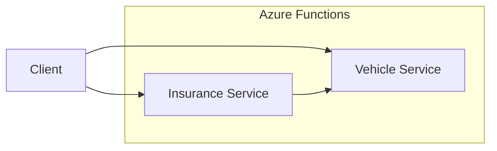

# ThreadPilot Documentation

Welcome to the ThreadPilot integration layer documentation. This directory contains comprehensive documentation for all components of the ThreadPilot system.

## 📚 Documentation Structure

```
docs/
├── README.md                    # This overview document
├── api-reference.md            # Quick API reference guide
└── functions/                  # Azure Functions documentation
    ├── README.md               # Functions overview
    ├── vehicle-service.md      # Vehicle Service detailed docs
    └── insurance-service.md    # Insurance Service detailed docs
```

## 🚀 Quick Start

### API Reference
For quick API endpoint reference, see [API Reference](./api-reference.md).

### Function Documentation
For detailed Azure Functions documentation, see [Functions Overview](./functions/README.md).

## 🏗️ System Architecture

ThreadPilot is a microservices-based integration layer consisting of two Azure Functions:

1. **Vehicle Service** - Provides vehicle information lookup
2. **Insurance Service** - Provides insurance information with vehicle integration



## 📖 Documentation Categories

### API Documentation
- **[API Reference](./api-reference.md)** - Complete API specification with examples
- **[Vehicle Service API](./functions/vehicle-service.md)** - Detailed Vehicle Service documentation
- **[Insurance Service API](./functions/insurance-service.md)** - Detailed Insurance Service documentation

### Development
- **[Functions Overview](./functions/README.md)** - Azure Functions development guide
- **[Infrastructure Documentation](../iac/README.md)** - Bicep templates and deployment
- **[Pipeline Documentation](../pipelines/azure-pipelines.yml)** - CI/CD pipeline configuration
- **[HTTP Request Files](../requests/README.md)** - Ready-to-use API test files for Visual Studio/VS Code

### Operations
- **[Monitoring](./functions/README.md#monitoring)** - Application Insights and observability
- **[Troubleshooting](./functions/README.md#troubleshooting)** - Common issues and solutions
- **[Security](./functions/README.md#security)** - Security considerations and best practices

## 🔗 Quick Links

### API Endpoints

**Development Environment:**
- Vehicle Service: `https://threadpilot-vehicle-dev.azurewebsites.net/api/vehicles/{registrationNumber}`
- Insurance Service: `https://threadpilot-insurance-dev.azurewebsites.net/api/insurances/{personalId}`

**Example Requests:**
```bash
# Get vehicle information
curl https://threadpilot-vehicle-dev.azurewebsites.net/api/vehicles/ABC123

# Get insurance information (includes vehicle data for car insurance)
curl https://threadpilot-insurance-dev.azurewebsites.net/api/insurances/19900101-1234
```

### Test Data

**Sample Vehicles:**
- `ABC123` - Volvo XC90 (Owner: 19900101-1234)
- `XYZ789` - Tesla Model 3 (Owner: 19850515-5678)
- `DEF456` - BMW 320i (Owner: 19750225-9012)

**Sample Insurance Holders:**
- `19900101-1234` - Car + Health insurance ($50/month)
- `19850515-5678` - Car + Pet + Health insurance ($60/month)
- `19750225-9012` - Pet insurance only ($10/month)

## 🛠️ Development Setup

### Prerequisites
- .NET 9 SDK
- Azure Functions Core Tools v4
- Visual Studio 2022 or VS Code

### Local Development
```bash
# Start Vehicle Service (Terminal 1)
cd src/api/ThreadPilot.Vehicle
func start --port 7071

# Start Insurance Service (Terminal 2)
cd src/api/ThreadPilot.Personal
func start --port 7072
```

### Testing
```bash
# Run all tests
dotnet test src/api/ThreadPilot.sln

# Test endpoints locally
curl http://localhost:7071/api/vehicles/ABC123
curl http://localhost:7072/api/insurances/19900101-1234
```

## 📊 Monitoring and Observability

### Application Insights
Both services are instrumented with Application Insights for:
- Request/response tracking
- Performance monitoring
- Error tracking
- Custom telemetry

### Health Checks
```bash
# Vehicle Service health
curl https://threadpilot-vehicle-dev.azurewebsites.net/api/vehicles/ABC123

# Insurance Service health (tests integration)
curl https://threadpilot-insurance-dev.azurewebsites.net/api/insurances/19900101-1234
```

## 🔒 Security

### Current Configuration
- **Authorization**: Anonymous (demo purposes)
- **HTTPS**: Enforced in production
- **Data**: In-memory storage for demonstration

### Production Recommendations
- Implement Azure AD authentication
- Add API key or certificate-based auth
- Configure CORS policies
- Add rate limiting
- Use Azure Key Vault for secrets

## 🚀 Deployment

### Automated Deployment
The system uses Azure DevOps pipeline for CI/CD:
1. **Build**: Compile code and run tests
2. **Infrastructure**: Deploy Bicep templates
3. **Applications**: Deploy Azure Functions

### Manual Deployment
```bash
# Deploy infrastructure
az deployment group create \
  --resource-group rg-threadpilot-dev \
  --template-file iac/vehicle-service.bicep \
  --parameters iac/vehicle-service.dev.bicepparam

# Deploy applications
func azure functionapp publish threadpilot-vehicle-dev
```

## 🆘 Support

### Getting Help
1. **Check Documentation**: Start with the relevant documentation section
2. **Review Logs**: Check Application Insights for errors and performance issues
3. **Test Locally**: Use local development environment to reproduce issues
4. **Contact Team**: Reach out to the ThreadPilot Integration Team

### Common Issues
- **Cold Start Latency**: Expected on first request after idle
- **Service Integration**: Check Vehicle Service availability for Insurance Service
- **Authentication**: Verify configuration when auth is implemented

### Useful Resources
- [Azure Functions Documentation](https://docs.microsoft.com/en-us/azure/azure-functions/)
- [Application Insights Documentation](https://docs.microsoft.com/en-us/azure/azure-monitor/app/app-insights-overview)
- [Bicep Documentation](https://docs.microsoft.com/en-us/azure/azure-resource-manager/bicep/)

## 📝 Contributing

When contributing to the documentation:

1. **Keep it Current**: Update docs when making code changes
2. **Be Comprehensive**: Include examples and common scenarios
3. **Follow Structure**: Use the established documentation structure
4. **Test Examples**: Verify all code examples work correctly

### Documentation Standards
- Use clear, concise language
- Include practical examples
- Provide troubleshooting information
- Keep navigation simple and logical

## 📈 Metrics and KPIs

### System Performance Targets
- **Response Time**: 95th percentile < 500ms
- **Availability**: > 99.9%
- **Error Rate**: < 0.1%
- **Vehicle Service Integration**: > 99% success rate

### Monitoring Queries
See the [Functions Overview](./functions/README.md#monitoring) for Application Insights KQL queries.

---

**Last Updated**: December 2024
**Version**: 1.0
**Maintained By**: ThreadPilot Integration Team