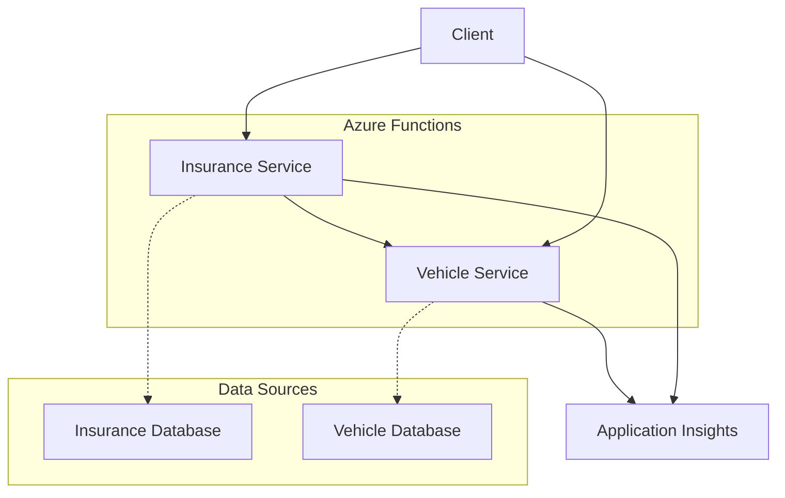

# ThreadPilot Azure Functions Documentation

## Overview

This directory contains comprehensive documentation for the ThreadPilot Azure Functions, which implement a microservices-based integration layer for vehicle and insurance data management.

## Service Architecture



## Services

### 1. Vehicle Service
- **Purpose**: Vehicle information lookup by registration number
- **Technology**: Azure Functions v4 (.NET 9)
- **Dependencies**: None (foundational service)
- **Documentation**: [Vehicle Service API](./vehicle-service.md)

### 2. Insurance Service
- **Purpose**: Insurance policy lookup with vehicle integration
- **Technology**: Azure Functions v4 (.NET 9)
- **Dependencies**: Vehicle Service
- **Documentation**: [Insurance Service API](./insurance-service.md)

## Quick Start

### Local Development

1. **Prerequisites**:
   ```bash
   # Install required tools
   dotnet --version  # Should be 9.0+
   func --version    # Azure Functions Core Tools v4
   ```

2. **Start Vehicle Service** (Terminal 1):
   ```bash
   cd src/api/ThreadPilot.Vehicle
   func start --port 7071
   ```

3. **Start Insurance Service** (Terminal 2):
   ```bash
   cd src/api/ThreadPilot.Personal
   func start --port 7072
   ```

4. **Test the Services**:
   ```bash
   # Test Vehicle Service
   curl http://localhost:7071/api/vehicles/ABC123
   
   # Test Insurance Service
   curl http://localhost:7072/api/insurances/19900101-1234
   ```

### Production URLs

- **Development Environment**:
  - Vehicle Service: `https://threadpilot-vehicle-dev.azurewebsites.net`
  - Insurance Service: `https://threadpilot-insurance-dev.azurewebsites.net`

- **Production Environment**:
  - Vehicle Service: `https://threadpilot-vehicle-prod.azurewebsites.net`
  - Insurance Service: `https://threadpilot-insurance-prod.azurewebsites.net`

## API Examples

### Complete Workflow Example

1. **Get Vehicle Information**:
   ```http
   GET /api/vehicles/ABC123
   Host: threadpilot-vehicle-dev.azurewebsites.net
   ```
   
   Response:
   ```json
   {
     "registrationNumber": "ABC123",
     "make": "Volvo",
     "model": "XC90",
     "year": 2022,
     "color": "Black",
     "ownerPersonalId": "19900101-1234"
   }
   ```

2. **Get Insurance Information** (includes vehicle data):
   ```http
   GET /api/insurances/19900101-1234
   Host: threadpilot-insurance-dev.azurewebsites.net
   ```
   
   Response:
   ```json
   {
     "personalId": "19900101-1234",
     "totalMonthlyCost": 50.00,
     "insurances": [
       {
         "id": "INS001",
         "type": "Car",
         "monthlyCost": 30.00,
         "isActive": true,
         "vehicleInfo": {
           "registrationNumber": "ABC123",
           "make": "Volvo",
           "model": "XC90",
           "year": 2022,
           "color": "Black"
         }
       },
       {
         "id": "INS002",
         "type": "PersonalHealth",
         "monthlyCost": 20.00,
         "isActive": true,
         "vehicleInfo": null
       }
     ]
   }
   ```

## Service Integration

### Communication Pattern

The Insurance Service integrates with the Vehicle Service using HTTP client:

```csharp
// Insurance Service calls Vehicle Service
var vehicleInfo = await _vehicleApiClient.GetVehicleInfoAsync(registrationNumber);
```

### Error Handling

The integration implements graceful degradation:
- If Vehicle Service is unavailable, Insurance Service still returns insurance data
- Vehicle information is omitted from the response
- Errors are logged but don't fail the entire request

### Configuration

The Insurance Service needs the Vehicle Service URL:

```json
{
  "VehicleServiceBaseUrl": "https://threadpilot-vehicle-dev.azurewebsites.net/api"
}
```

## Sample Data

### Test Vehicles
| Registration | Make | Model | Year | Owner |
|-------------|------|-------|------|-------|
| ABC123 | Volvo | XC90 | 2022 | 19900101-1234 |
| XYZ789 | Tesla | Model 3 | 2023 | 19850515-5678 |
| DEF456 | BMW | 320i | 2021 | 19750225-9012 |

### Test Insurance Policies
| Personal ID | Insurances | Monthly Cost |
|-------------|-----------|--------------|
| 19900101-1234 | Car (ABC123), Health | $50 |
| 19850515-5678 | Car (XYZ789), Pet, Health | $60 |
| 19750225-9012 | Pet | $10 |

## Common Operations

### Health Checks

**Vehicle Service Health**:
```bash
curl https://threadpilot-vehicle-dev.azurewebsites.net/api/vehicles/ABC123
# Expected: 200 OK with vehicle data
```

**Insurance Service Health**:
```bash
curl https://threadpilot-insurance-dev.azurewebsites.net/api/insurances/19900101-1234
# Expected: 200 OK with insurance data including vehicle info
```

**Integration Health**:
```bash
# This tests the full integration flow
curl https://threadpilot-insurance-dev.azurewebsites.net/api/insurances/19900101-1234
# Should include vehicleInfo for car insurance
```

### Load Testing

**Simple Load Test** (using Apache Bench):
```bash
# Test Vehicle Service
ab -n 1000 -c 10 https://threadpilot-vehicle-dev.azurewebsites.net/api/vehicles/ABC123

# Test Insurance Service
ab -n 1000 -c 10 https://threadpilot-insurance-dev.azurewebsites.net/api/insurances/19900101-1234
```

## Monitoring

### Application Insights Queries

**Request Volume**:
```kusto
requests
| where timestamp > ago(1h)
| summarize count() by bin(timestamp, 5m), name
| render timechart
```

**Error Rate**:
```kusto
requests
| where timestamp > ago(1h)
| summarize 
    Total = count(),
    Errors = countif(success == false)
| extend ErrorRate = (Errors * 100.0) / Total
```

**Service Dependencies**:
```kusto
dependencies
| where timestamp > ago(1h)
| where target contains "threadpilot-vehicle"
| summarize 
    count(),
    avg(duration),
    percentile(duration, 95)
by bin(timestamp, 5m)
| render timechart
```

### Performance Metrics

Monitor these key metrics:
- **Response Time**: 95th percentile should be < 500ms
- **Availability**: Should be > 99.9%
- **Error Rate**: Should be < 0.1%
- **Vehicle Service Integration**: Dependency success rate > 99%

## Security

### Current Configuration
- **Authorization**: Anonymous (demo purposes)
- **HTTPS**: Enforced in production
- **CORS**: Not configured (needs setup for browser clients)

### Production Security Checklist
- [ ] Implement Azure AD authentication
- [ ] Configure API keys or client certificates
- [ ] Set up CORS policies
- [ ] Enable request throttling
- [ ] Configure Web Application Firewall
- [ ] Implement input validation and sanitization
- [ ] Set up Azure Key Vault for secrets

## Deployment

### Automated Deployment

The services are deployed automatically via Azure DevOps pipeline:

1. **Build Stage**: Compile, test, package
2. **Infrastructure Stage**: Deploy Bicep templates
3. **Application Stage**: Deploy Function Apps

**Pipeline File**: `/pipelines/azure-pipelines.yml`

### Manual Deployment

**Deploy Infrastructure**:
```bash
# Deploy Vehicle Service infrastructure
az deployment group create \
  --resource-group rg-threadpilot-dev \
  --template-file iac/vehicle-service.bicep \
  --parameters iac/vehicle-service.dev.bicepparam

# Deploy Insurance Service infrastructure
az deployment group create \
  --resource-group rg-threadpilot-dev \
  --template-file iac/insurance-service.bicep \
  --parameters iac/insurance-service.dev.bicepparam
```

**Deploy Applications**:
```bash
# Deploy Vehicle Service
cd src/api/ThreadPilot.Vehicle
func azure functionapp publish threadpilot-vehicle-dev

# Deploy Insurance Service
cd src/api/ThreadPilot.Personal
func azure functionapp publish threadpilot-insurance-dev
```

## Testing

### Unit Tests
```bash
# Run all tests
dotnet test src/api/ThreadPilot.sln

# Run specific service tests
dotnet test tests/ThreadPilot.Vehicle.Tests/
dotnet test tests/ThreadPilot.Personal.Tests/
```

### Integration Tests
```bash
# Test Vehicle Service endpoint
curl https://threadpilot-vehicle-dev.azurewebsites.net/api/vehicles/ABC123

# Test Insurance Service endpoint
curl https://threadpilot-insurance-dev.azurewebsites.net/api/insurances/19900101-1234

# Test error scenarios
curl https://threadpilot-vehicle-dev.azurewebsites.net/api/vehicles/INVALID
curl https://threadpilot-insurance-dev.azurewebsites.net/api/insurances/invalid-format
```

## Troubleshooting

### Common Issues

1. **Cold Start Latency**
   - Expected on first request after idle period
   - Consider Premium plan for production
   - Monitor Application Insights for cold start metrics

2. **Service Integration Failures**
   - Check Vehicle Service availability
   - Verify network connectivity between services
   - Review dependency tracking in Application Insights

3. **Authentication Errors** (when implemented)
   - Verify Azure AD configuration
   - Check API key validity
   - Review CORS settings for browser clients

### Debugging

**Local Debugging**:
```bash
# Start with debugging enabled
func start --port 7071 --verbose

# View detailed logs
func azure functionapp logstream threadpilot-vehicle-dev --verbose
```

**Production Debugging**:
- Use Application Insights Live Metrics
- Review Function App logs in Azure Portal
- Check Application Insights dependency tracking

## Support

### Documentation
- [Vehicle Service API](./vehicle-service.md) - Detailed Vehicle Service documentation
- [Insurance Service API](./insurance-service.md) - Detailed Insurance Service documentation
- [Infrastructure Documentation](../../iac/README.md) - Bicep templates and deployment
- [Main Project Documentation](../../README.md) - Overall project documentation

### Code Locations
- **Source Code**: `src/api/`
- **Unit Tests**: `tests/`
- **Infrastructure**: `iac/`
- **Pipeline**: `pipelines/azure-pipelines.yml`